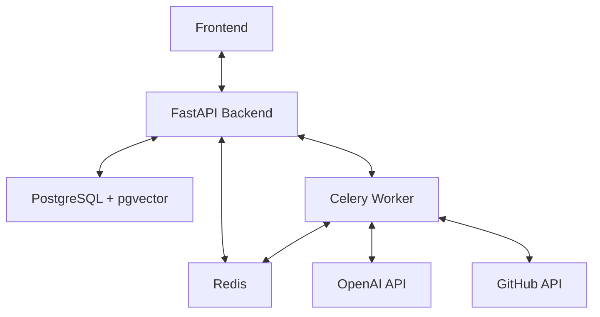

# OmniCode

[](https://github.com/yourusername/omnicode/actions/workflows/backend.yml)
[](https://github.com/yourusername/omnicode/actions/workflows/frontend.yml)
[](https://opensource.org/licenses/MIT)
[](https://github.com/yourusername/omnicode/releases)

AI-powered code analysis and automation platform. OmniCode leverages advanced agentic workflows to help developers understand, refactor, and automate their codebase.

## 🚀 Features

- **Agentic Workflows**: Powered by LangGraph for complex, multi-step code reasoning and execution.
- **Modern Tech Stack**: Next.js 14 (App Router), FastAPI, and PostgreSQL with pgvector.
- **Interactive UI**: Real-time updates, code exploration, and terminal-like experience.
- **GitHub Integration**: Seamless authentication and repository access via GitHub OAuth.
- **Self-Hostable**: Easy deployment with Docker and Docker Compose.
- **Production Ready**: Structured logging, rate limiting, and secure configuration.

## 🏗️ Architecture

OmniCode consists of three main components:

1.  **Frontend**: A Next.js 14 application providing a rich, responsive interface using Tailwind CSS and shadcn/ui.
2.  **Backend**: A FastAPI server that handles API requests, manages state, and orchestrates LangGraph agents.
3.  **Worker**: A Celery worker for processing long-running AI tasks asynchronously.



## 🛠️ Getting Started

### Prerequisites

- Docker & Docker Compose v2
- GitHub OAuth Application ([Create one here](https://github.com/settings/developers))
- OpenAI API Key

### Quick Start (Local Development)

1.  **Clone the repository**:
    ```bash
    git clone https://github.com/yourusername/omnicode.git
    cd omnicode
    ```

2.  **Configure Environment Variables**:
    ```bash
    cp .env.example .env
    ```
    Update `.env` with your `GITHUB_CLIENT_ID`, `GITHUB_CLIENT_SECRET`, and `OPENAI_API_KEY`.

3.  **Start the services**:
    ```bash
    docker-compose up
    ```

4.  **Initialize the Database**:
    ```bash
    docker-compose exec backend python init_db.py
    ```

5.  **Access the application**:
    - Frontend: [http://localhost:3000](http://localhost:3000)
    - API Documentation: [http://localhost:8000/docs](http://localhost:8000/docs)

### 📦 Self-Hosting (Production)

For production environments, use the provided production configuration:

```bash
docker-compose -f docker-compose.prod.yml up -d
```

Ensure you have set the following production-specific variables in your `.env`:
- `ENVIRONMENT=production`
- `NEXTAUTH_URL=https://your-domain.com`
- `ENCRYPTION_KEY` (Generate with instructions in `.env.example`)
- `JWT_SECRET` (Generate with instructions in `.env.example`)

## 🤝 Contributing

We welcome contributions! Please see our [CONTRIBUTING.md](CONTRIBUTING.md) for guidelines on how to get started.

## 🛡️ Security

If you discover a security vulnerability within OmniCode, please see our [SECURITY.md](SECURITY.md).

## 📄 License

OmniCode is open-source software licensed under the [MIT license](LICENSE).
